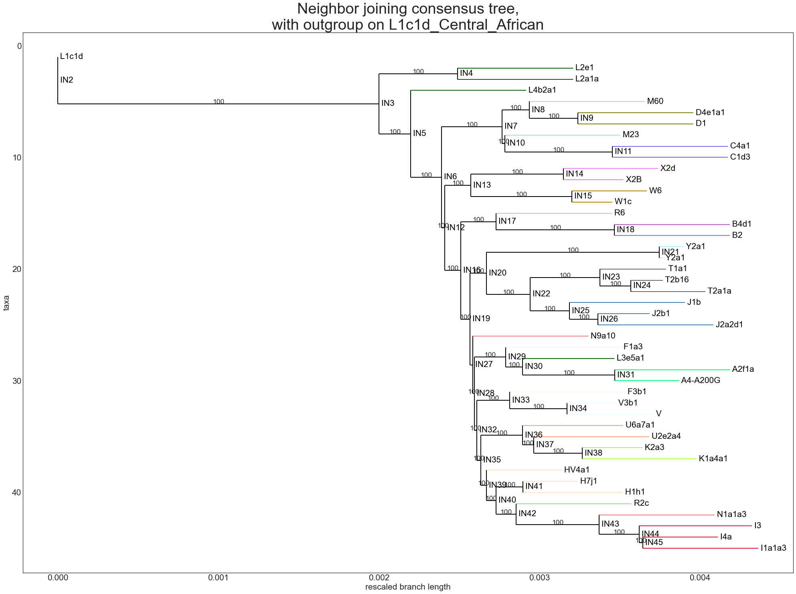
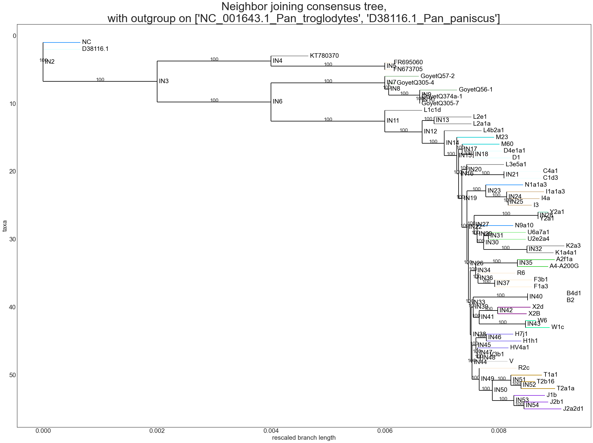

```python
import numpy as np
import os
from tqdm.notebook import tqdm
import matplotlib as mpl
from Bio import SeqIO, Phylo
import matplotlib.pyplot as plt
from Bio.Phylo.PhyloXML import Phylogeny
from Bio.Phylo.TreeConstruction import DistanceTreeConstructor, DistanceCalculator
from Bio.Phylo.Consensus import *
from Bio import AlignIO
import pylab
import networkx as nx
import gc

np.random.seed(7)
gc.enable()
plt.style.use('seaborn-white')
```


```python
# FastTree - works really fast, + bootstrap, results in wiered branch lengths
# Biopython - really slow consensus, and bootrsrap -> results in nice distances
```


```python
NT = 1 # let's skip bootstaping for BioPython
per_genome_per_year = 1.947 * 10**-4 # (Cabrera V. M., 2021)
mtDNA_length = 16559
```


```python
def read_mulitple_write_to_one(dirs=['Human/'],
                               output_file='unalaigned.fasta',
                               rename_after_file_name=True):

    all_records = []

    for directory in dirs:
        records = []
        for record in tqdm(os.listdir(directory)):
            records.append(SeqIO.read(directory + record, "fasta"))

        if rename_after_file_name:
            _ = [
                setattr(record, 'id',
                        name.replace('.fasta', '').replace(' ', '_'))
                for name, record in zip(os.listdir(directory), records)
            ]

        all_records.extend(records)

    SeqIO.write(all_records, output_file, "fasta")

    return read_mulitple_write_to_one
```


```python
def run_mafft_docker_container(container_name='staphb/mafft',
                               settings_string = '--auto',
                               input_file = 'unalaigned.fasta',
                               output_file = 'alaigned.fasta'):
    # 0 non error exit
    return os.system(f"docker run --rm -v {os.getcwd()}:/data {container_name} mafft {settings_string} {input_file} > {output_file}")
```


```python
def run_fasttree_docker_container(container_name='pegi3s/fasttree',
                               settings_string = '-boot 1000 -nt',
                               input_file = 'aligned.fasta',
                               output_file = 'output.tre'):
    # 0 non error exit
    return os.system(f'docker run --rm -v {os.getcwd()}:/data {container_name} bash -c "FastTree {settings_string} /data/{input_file} > /data/{output_file}"')
```


```python
read_mulitple_write_to_one(dirs=['Human/'], output_file='unalaigned1.fasta')
```


      0%|          | 0/45 [00:00<?, ?it/s]


    <function __main__.read_mulitple_write_to_one(dirs=['Human/'], output_file='unalaigned.fasta', rename_after_file_name=True)>


```python
run_mafft_docker_container(input_file='unalaigned1.fasta',
                           output_file='alaigned1.fasta')
```


    0


```python
run_fasttree_docker_container(input_file='alaigned1.fasta',
                              settings_string = f'-boot {NT} -rawdist -gtr -nt', # -rawdist
                              output_file='tree1.tre')
```


    0


```python
def build_tree(msa='aligned.fasta',
               target_tree='tree.tre',
               outgroup='L1c1d_Central_African',
               n_trees=10):

    msa = AlignIO.read(msa, 'fasta')

    if not target_tree:
        
        #calculator = DistanceCalculator('identity')
        #dm = calculator.get_distance(msa)
        #constructor = DistanceTreeConstructor(method='nj')
        #tree = constructor.nj(dm)
        
        calculator = DistanceCalculator('identity')
        constructor = DistanceTreeConstructor(calculator, method='nj')
        trees = bootstrap_trees(msa, n_trees, constructor)
        #tree = get_support(target_tree, trees, len_trees=n_trees)
        tree = majority_consensus(trees, cutoff=0.7)

    else:
        tree = Phylo.read(target_tree, "newick")


    if outgroup:
        tree.root_with_outgroup(outgroup)

    tree.ladderize()
    
    K = [1]
    for node in tree.get_nonterminals():
        if not node.name:
            
            K[0]+=1
            node.name = 'Inner'+str(K[0])

    return tree
```


```python
def draw_tree(tree, title, figsize=(28, 21), axvspan=(0, 0)):

    tree = Phylogeny.from_tree(tree)

    md = np.median([
        path.branch_length for path in tree.get_nonterminals()
        if path.branch_length
    ])

    for path in tree.get_nonterminals():
        if path.branch_length:
            path.branch_length = min(min(np.log1p(path.branch_length),
                                     np.log1p(md)+np.log1p(path.branch_length)**0.1), 0.002)

    colors = {}

    md = np.median([
        leaf.branch_length for leaf in tree.get_terminals()
        if leaf.branch_length
    ])
    for leaf in tree.get_terminals():
        leaf.branch_length = min(np.log1p(leaf.branch_length), np.log1p(md))

        if leaf.name[0] in colors.keys():
            leaf.color = colors[leaf.name[0]]
        else:
            colors[leaf.name[0]] = mpl.colors.cnames[list(
                mpl.colors.cnames.keys())[np.random.randint(
                    0,
                    len(mpl.colors.cnames.keys()) - 1)]]
            leaf.color = colors[leaf.name[0]]

    plt.rcParams["figure.figsize"] = figsize
    mpl.rcParams['lines.linewidth'] = 2
    mpl.rcParams["font.size"] = 21
            
    def label_function(x):
        if '_' in str(x):
            return str(x).replace('_', ' ').split()[0]
        elif 'Inner' in str(x):
            return str(x).replace('Inner','IN')
        return x.split()[0]

    fig = plt.subplot()

    Phylo.draw(tree,
               axes=fig,
               label_func=lambda x: label_function(x),
               do_show=False,
               axvspan=axvspan)

    fig.set_title(title, fontsize=38)
    fig.set_xlabel('rescaled branch length')

    fig.autoscale()

    plt.tight_layout()
    plt.show()

    return draw_tree
```


```python
outgroup1 = 'L1c1d_Central_African'

tree1 = build_tree('alaigned1.fasta',
                    None,
                    outgroup='L1c1d_Central_African',
                    n_trees=NT)


terminals1 = [t.name for t in tree1.get_terminals()]
```


```python
draw_tree(tree1, f'Neighbor joining consensus tree,\nwith outgroup on {outgroup1}')
```


    

    


    <function __main__.draw_tree(tree, title, figsize=(28, 21), axvspan=(0, 0))>


```python
def get_constant_years_from_identity(tree, a, b):

    for node in tree.nodes:
        if str(node).strip() == a:
            a = node
        elif str(node) == b:
            b = node

    path = nx.shortest_path(tree, a, b)
    #print(f'from {a} -> {b} through {[p.name for p in path[1:-1]]}')
    return sum([p.branch_length/2
                for p in path[1:-1]]) * mtDNA_length / per_genome_per_year
```


```python
tree1 = Phylo.to_networkx(tree1)
```


```python
d = []
for t in terminals1:
    try:
        d.append(get_constant_years_from_identity(tree1, 'Inner2', t))
    except:
        pass

np.mean([dd for dd in d if dd > 0])
```


    189969.8773837197


```python
d = []
for t in terminals1:
    try:
        d.append(get_constant_years_from_identity(tree1, 'Inner5', t))
    except:
        pass
np.mean([dd for dd in d if dd > 0])
```


    43175.55452501035


```python
read_mulitple_write_to_one(
    dirs=['Human/', 'Neanderthal/', 'Denisova/', 'Pan/'],
    output_file='unalaigned2.fasta')
```


      0%|          | 0/45 [00:00<?, ?it/s]


      0%|          | 0/5 [00:00<?, ?it/s]


      0%|          | 0/3 [00:00<?, ?it/s]


      0%|          | 0/2 [00:00<?, ?it/s]


    <function __main__.read_mulitple_write_to_one(dirs=['Human/'], output_file='unalaigned.fasta', rename_after_file_name=True)>


```python
run_mafft_docker_container(input_file='unalaigned2.fasta',
                           output_file='alaigned2.fasta')
```


    0


```python
run_fasttree_docker_container(input_file='alaigned2.fasta',
                              settings_string = f'-boot {NT} -nt',
                              output_file='tree2.tre')
```


    0


```python
outgroup2 = ['NC_001643.1_Pan_troglodytes', 'D38116.1_Pan_paniscus']
tree2 = build_tree('alaigned2.fasta', None, outgroup=outgroup2, n_trees=NT)

terminals2 = [t.name for t in tree2.get_terminals()]
```


```python
draw_tree(
    tree2,
    f'Neighbor joining consensus tree,\nwith outgroup on {outgroup2}')
```


    

    


    <function __main__.draw_tree(tree, title, figsize=(28, 21), axvspan=(0, 0))>


```python
tree2 = Phylo.to_networkx(tree2)
```


```python
d = []
for t in terminals1[10:]:
    try:
        d.append(get_constant_years_from_identity(tree2, 'Inner3', t))
    except:
        pass
np.mean([dd for dd in d if dd > 0])
```


    519369.77210530307


1. Kinene T. [et al]. Rooting Trees, Methods for // Encyclopedia of Evolutionary Biology [Online]. URL: https://www.ncbi.nlm.nih.gov/pmc/articles/PMC7149615/.

2. Archives: mtDNA Stories // haplogroup.org [Online]. URL: https://haplogroup.org/mtdna/.

3. Cabrera V. M. Human molecular evolutionary rate, time dependency and transient polymorphism effects viewed through ancient and modern mitochondrial DNA genomes // Scientific Reports [Online]. URL: https://doi.org/10.1038/s41598-021-84583-1.

4. Thomson J. Humans did come out of Africa, says DNA // Nature [Online]. URL: https://doi.org/10.1038/news001207-8.
